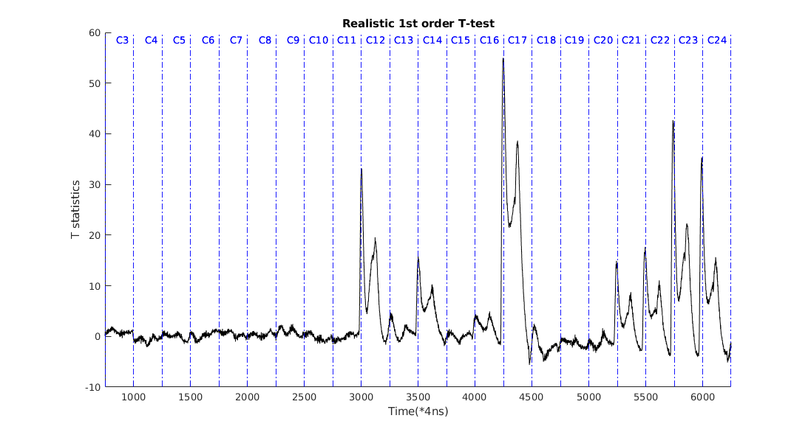
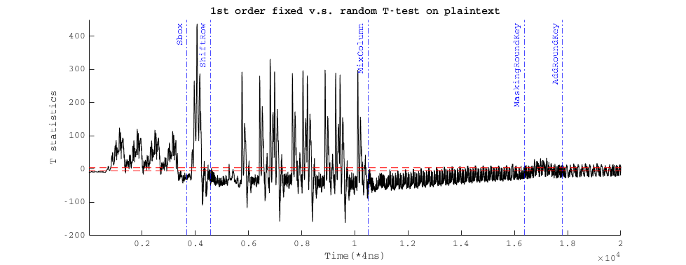
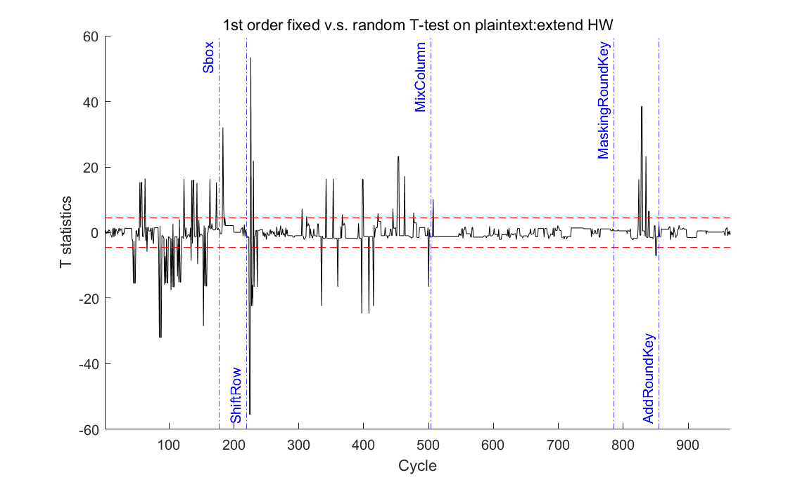
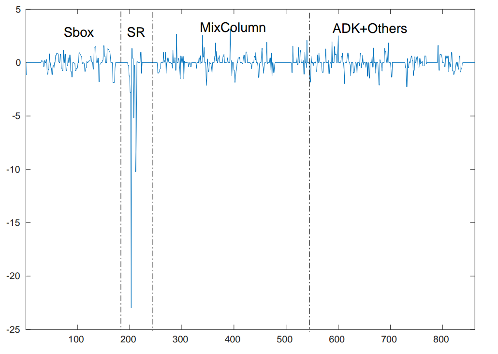
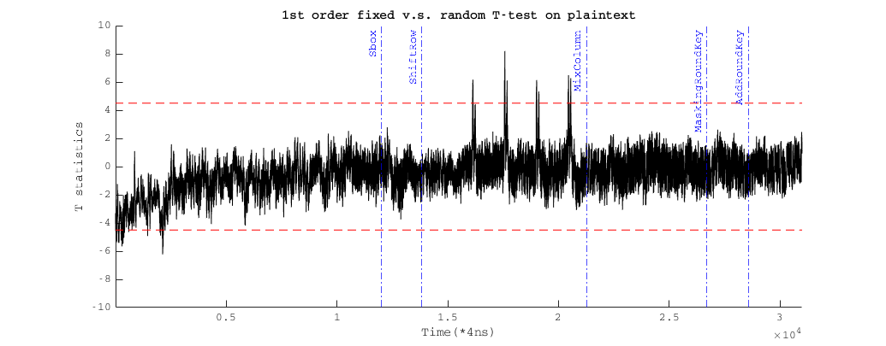
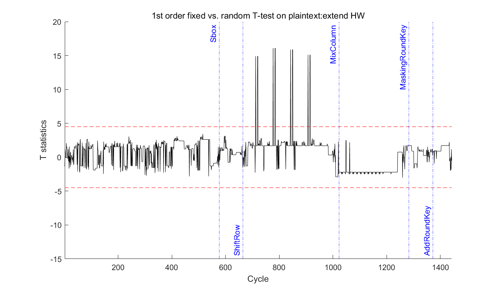
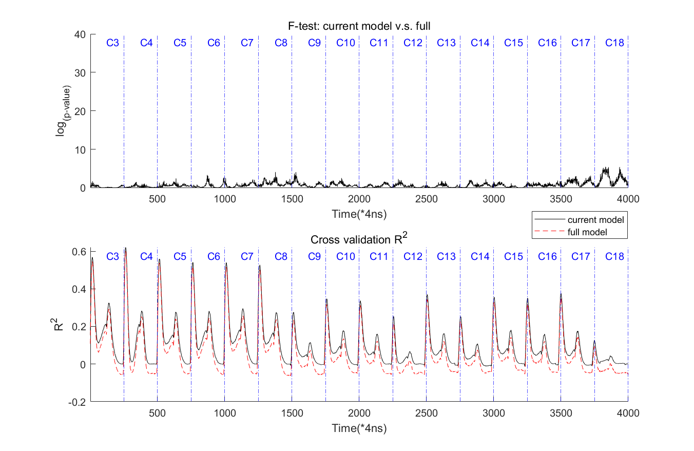

# &#956; ELMO: micro-arhictecture enhanced Emulator for power Leakages for 3-stage pipelined ARM Cortex-M cores
## Intro
### What is ELMO?
ELMO is an elmentary statistical leakage simulator for the ARM M0 family, originally designed by David McCann, Elisabeth Oswald and Carolyn Whitnall, published at [USENIX 2017](https://www.usenix.org/conference/usenixsecurity17/technical-sessions/presentation/mccann).

The ELMO tool can be found at https://github.com/sca-research/ELMO

### Features of ELMO
- Simulation on ARM binary code (vs. on abstract algorithmic description)
- Leakage model derived from realistic measurements (i.e. less general, yet more accurate compared with the standard HW/HD model)
- Only support for [Thumb-16 instructions](https://developer.arm.com/documentation/qrc0006/e)
- Based on 3 adjacent instruction sequence
- Built on a specific M0 core (STM32F0, 8MHz)
- Only for in-core leakage (i.e. memory leakage not included)

### Limitations & Extensions of ELMO
- Specific to the selected M0 core (STM32F0, 8MHz)
- 3-instruction window cannot capture long distance inter-instruction leakage (e.g. the memory bus)
- For leakage detection, users must set it up in their target ARM code, i.e. loop the target code for N times to produce N traces, set the first half with fixed input and the second half with random input 
- Point-of-Interest selection: local peaks in each cycle
- Incorrect micro-architecture inference
- No quality evaluation: CPA/TVLA/raw trace "looks alike" type of argument (same as all other leakage simulators)

Some limitations above are easier to solve, e.g.
- Verify the same technology on another M0 core from NXP (Si Gao, 2018.09, newly built model can be found in [coeffs_LPC.txt](https://github.com/sca-research/ELMO/blob/master/coeffs_LPC.txt)
- Select the number of traces from command line arguments(Si Gao, 2018.11)
- Memory extensions individually developed by Si Gao (2020.02 at https://github.com/sca-research/ELMO/tree/7ed16280fab83631dcb11ed0fec97e054b1fcb24) and the ROSITA team's [ELMO*](https://github.com/0xADE1A1DE/Rosita)

However, the chance of solving the other issues while staying in the ELMO framework seems gloomy. For instance, the dominating leakage of ELMO is from the two [operand data-buses](https://www.usenix.org/conference/usenixsecurity17/technical-sessions/presentation/mccann) within the ALU. Unfortunately, both two operands lie in the **micro-architecture**, which is not entirely infer-able from the Thumb instruction. In other words, although not mentioned explicitly, all ELMO extensions are restricted by the original micro-architecture guess (i.e. from Dr. David McCann).

Despite the realistic RTL source code for Cortex M0 is not available (ARM provided an obfuscated version for academic usage), for Cortex M3, ARM provides a readable version for academic/education purpose. The M3 leakage simulator [MAPS](https://link.springer.com/chapter/10.1007%2F978-3-319-89641-0_5) was built on the knowledge of this HDL code. Although there is no guarantee any M3 core or M0 core on the market must follow the same design, for some instructions, the pipeline registers convention is actually quite different from what ELMO predicted.  Since all extensions did not update the pipeline register assignments made in ELMO, they share the same short-come when ELMO failed to predict the micro-architectural data flow.
  
## Meet &#956;ELMO
As the name suggests, &#956;ELMO aims at taking the leakage-relevant micro-architecture features into account. Unlike MAPS, we insist our tool be a grey-box one, where the accurate HDL source of the design is not given. Considering that:
- ARM only reveals one Cortex M3 and one (obfuscated) Cortex M0. The source code for other cores is not given for now.
- Even for the given Cortex M3, there is no guarantee that ARM has only one universal design. Both the manufacturers and ARM themselves might use a different version in off-the-shelf products.
- In a RISC-V platform, the manufacturers can still customise their architecture. The ISA is open-sourced, but the core design is not necessarily the same.

Thus, from a methodology point of view, we believe it is sensible to have some techniques that built leakage models in a grey-box scenario. Having said that, if the application provides accurate source code, of course, one would opt for white-box approaches, rather than our methodology here. 

 
### Compared with ELMO
Similarity:
- Both restricted with Thumb-16 instructions
- Both share the same ELMO API, for emulated input/output/randomness/trigger control
- Inherit some functional code from ELMO 

Difference:
- &#956;ELMO was built on a Cortex M3 core(NXP LPC1313). However, as the modelling methodology is designed for a 3-stage pipelined core in general, we expect the methodology (not the built model) can be extended to other cores.
- Unlike ELMO, &#956;ELMO uses nominal models. In other words, ELMO simulates a leakage point on the trace, while &#956;ELMO only tells **what is leaking on this point** (e.g. operand, bus, etc.). This abstract model helps to overcome various "board effects", i.e. the individual chip difference
- &#956;ELMO has a real concept of *cycle*. Unlike ELMO, &#956;ELMO simulates a 3-stage pipeline. As a comparison, ELMO emulates one instruction at one go: if it is set to the "CYCLE ACCURATE" mode and the instruction could last for 2 cycles (e.g. LDR), ELMO will simply replicate the current leakage point to 2 leakage points. Of course, both can be wrong sometimes, but in our experience on a Cortex M3(NXP lpc1313), &#956;ELMO is more accurate. 
- For $N$ traces, &#956;ELMO requires the ARM binary for only one trace. N can be set through the command line.
- For leakage detections, users do not set up the inputs for the fix or random in ARM binary. Instead, users use readbyte() for FvR input and turn on -fvr in command line. In this case, the first half of the traces get a fixed 0 for readbyte(), while the other half gets randomness. This is a long-standing issue in ELMO: sometimes the fixed or random setup in ARM binary affects the simulated traces, which brings false positives that should not appear in practice.

-  &#956;ELMO captures leakage from the decoder, ALU and the memory subsystem.
-  &#956;ELMO extensively evaluated the **quality** of the built model, details see [our paper](https://eprint.iacr.org/2021/794). 

### Modelling methodology
Unlike ELMO which relies on David's micro-architectural guess, &#956;ELMO involves intensive reverse engineering effort. Although this step turns out to be inefficient and requires manual effort, it also highlights the threat of side-channel based reverse engineering against unprotected cores, which is in fact, of its interest. On the other hand, our statistical technique ensures the quality of the built leakage model is not too far from practice, which is not provided by any previous tool. More details can be found in [our paper](https://eprint.iacr.org/2021/794). 

The reverse-engineered micro-architecture/leakage model was built by Si Gao, Elisabeth Oswald and Dan Page. We would also like to thank Ben Marshall for his insightful feedback and wisdom in the early discussion phase of this project.

### Workflow for &#956;ELMO
A straightforward challenge for leakage detections on nominal model-based leakage simulators is, the leakage point does not have any numeric meaning, which suggests the TVLA-like technique is not applicable. Besides, to ensure the entire project can be extended to other platforms (e.g. RISC-V) as well, it is better to have a general framework, where the leakage model and emulator do not have to be bounded in source code. 

For this purpose, the current workflow of &#956;ELMO is:
1. Run micro-architecture enhanced emulator, output the entire core status at each cycle (including micro-architecture and memory status) to a file called execution data file (*.dat). 
2. Read in the produced execution data file. According to the assigned leakage model (whether set from code or some configuration file), produce a nominal leaking binary file (*.bin).
3. Run a separate python script to analyse the leaking binary file, whether performing leakage detection or, analysing the model quality.

Currently Step 1 is called "uELMO", Step 2 is called "LeakageExtractor" and Elmo_verif_Test() for Step 3. 

Currently, the framework development is led by Yan Yan, while the initial &#956;ELMO tool is coded by Si Gao. 

### Tutorial: Masked 2-share ISW bitwise multiplication
> ARM source code in "Windows/uELMO/Examples/ISWd2/Detection" 
> Compile binary in Ubuntu with GNU ARM GCC
  

#### Step 1: Run micro-architecture enhanced emulator
 Command line
`uELMO.exe [ARM_BINARY.bin]  -o [EXECUTION_DATA.dat]  -r [RANDOM_INPUT.txt] -N 1000 -fvr`

- `ARM_BINARY.bin`: the ARM binary file, same as ELMO, but contains only 1 trace
- `EXECUTION_DATA.dat`: the output execution data file of this step
- `RANDOM_INPUT.txt`: Selecting a certain input file for ELMO's readbyte() function. This is mainly designed for aligning randomness in the realistic acquistion and ELMO simulation so that we can verify the model's "quality". 
- `-N`: number of traces
- `-fvr`: Optional, if set, the first half of traces get 0 from readbyte(), while the second half get randomness.

#### Step 2: Apply the leakage model, produce the nominal leaking binary file 

Command line
`LeakageExtractor.exe [EXECUTION_DATA.dat] -o [LEAKY_STATES.bin]`

- `EXECUTION_DATA.dat`: the execution data file from Step 1
- `LEAKY_STATES.bin`: output file for Step 3

#### Step 3: 1st order detection with Python
Requires: numpy, hashlib
Script: `uELMO/Python Detection/uELMO/Elmo_verif_Test.py`
`Elmo_verif_Test().Elmo_verif_Test_1st_linear([LEAKY_STATES.bin],
    N, [HEADER_DISP.TXT])
- `LEAKY_STATES.bin`: Leakage state file
- `N`: number of traces
- `HEADER_DISP.TXT`: discription for all the cycles and leakage components

Running this script generates a text file `Positive_T-test_cycle.txt`. The content suggests the following leaky cycles:
 
 | Cycle no | Time sample | Instruction       | Leaky states |
|-------------|-------------|-------------------|--------------|
|  Cycle 3    | 750-1000    | ldr r1, [r0, #0]  |              |
|   Cycle 4    | 1000-1250   | ldr r3, [r0, #8]  |              |
|   Cycle 5    | 1250-1500   | ldr r2, [r0, #4]  |              |
|   Cycle 6    | 1500-1750   | ldr r4, [r0, #12] |              |
|   Cycle 7    | 1750-2000   | LDR delay         |              |
|   Cycle 8  | 2000-2250   | mov  r6, r1         |              |
|   Cycle 9  | 2250-2500   | ands r6, r3         |              |
|   Cycle 10 | 2500-2750   | mov  r7, r4         |              |
|   Cycle 11 | 2750-3000   | ands r7, r2         |              |
| **Cycle 12** | 3000-3250   | ands r1, r4       |result/CPSR HD|
| **Cycle 13** | 3250-3500   | eors r1, r5       | CPSR/Port HD |
| **Cycle 14** | 3500-3750   | ands r2, r3       | p-reg HD     |
|   Cycle 15   | 3750-4000   | eors r1, r2       |              |
| **Cycle 16** | 4000-4250   | eors r6, r1       | Port HD      |
| **Cycle 17** | 4250-4500   | eors r7, r5       |p-reg HD      |
| **Cycle 18** | 4500-4750   | mov r2, r9        | CPSR HD      |
|   Cycle 19   | 4750-5000   | nop               |              |
|   Cycle 20   | 5000-5250   | nop               |              |
| **Cycle 21** | 5250-5500   | str r6, [r2,#0]   | Port HD      |
| **Cycle 22** | 5500-5750   | str r7, [r2,#4]   | p-reg HD     |
| **Cycle 23** | 5750-6000   | nop               | Bus HD       |
| **Cycle 24** | 6000-6250   | nop               | Buffer HD    |

This suggests most cycles on the trace should be leaky. If we check why they are leaky,
- result HD: ALU output bus Hamming Distance
- Port HD: Decoding/Pr-loading HD, not stable due to glitches
- p-reg HD: Register HD
- Bus HD: Memory bus HD
- Buffer HD: Memory buffer HD

#### Comparision with realistic T-test
`Ttest-O1_RNGON.txt` in `Examples/ISWd2/Detection` is the 1st order TVLA results with the same piece of code. We use 50k traces for the test and still trim the randomness to 2-bit. 

 

It is trivial to see that matches quite well with our table above.  
Note that it is unclear whether Cycle 13 and Cycle 18 will turn into exploitable leakage in the end. In our current 50k traces, it seems that they might. That leakage has a reason to be weaker, yet can still be exploitable. We did not claim a reasonable cut-off point here: rather, we would prefer to let users define a cut-off point as he or she needs. Even neighbouring effects can be exploited in certain application scenarios; there is no guarantee they won't show up if we increase the number of traces to a larger number, say 1 million. However, there is also no guarantee that they will be a problem either, as the statistics only ensures there is some interaction, but not necessarily an exploitable one.

For different setups, users can adjust `Windows/LeakageExtractor/LeakageExtractor/LeakageModel.h` to add/remove a certain component. For instance, to add the so-called [Neightbouring effect](https://doi.org/10.1007/978-3-319-64647-3_17), one can set the following to 1
> #define LSB_NEIGHBOUR 0//Allows for LSB based neibouring effect
Re-run Step 2 and 3 shall add the neightbouring effect into consideration.

#### Comparision with ELMO result
The same setup can apply to ELMO. Yet, the comparison can be tricky, since ELMO is not cycle-accurate. Although there is `CYCLE_ACCURATE` option, this simply means counting every `LDR/STR` as 2 cycles. Therefore, unlike before, here we cannot provide a cycle by cycle comparison. Nonetheless, we can still provide an instruction wise comparison. ELMO report 4 cycles/3 leaking instructions:

  | Cycle no | Time sample | Instruction       | Leaky states |
|-------------|-------------|-------------------|--------------|
|  Cycle 3    | 750-1000    | ldr r1, [r0, #0]  |              |
|   Cycle 4    | 1000-1250   | ldr r3, [r0, #8]  |              |
|   Cycle 5    | 1250-1500   | ldr r2, [r0, #4]  |              |
|   Cycle 6    | 1500-1750   | ldr r4, [r0, #12] |              |
|   Cycle 7    | 1750-2000   | LDR delay         |              |
|   Cycle 8  | 2000-2250   | mov  r6, r1         |              |
|   Cycle 9  | 2250-2500   | ands r6, r3         |              |
|   Cycle 10 | 2500-2750   | mov  r7, r4         |              |
|   Cycle 11 | 2750-3000   | ands r7, r2         |              |
|   Cycle 12   | 3000-3250   | ands r1, r4       |              |
|   Cycle 13   | 3250-3500   | eors r1, r5       |              |
| **Cycle 14** | 3500-3750   | ands r2, r3       |              |
|   Cycle 15   | 3750-4000   | eors r1, r2       |              |
|   Cycle 16   | 4000-4250   | eors r6, r1       |              |
| **Cycle 17** | 4250-4500   | eors r7, r5       |              |
|   Cycle 18   | 4500-4750   | mov r2, r9        |              |
|   Cycle 19   | 4750-5000   | nop               |              |
|   Cycle 20   | 5000-5250   | nop               |              |
|   Cycle 21   | 5250-5500   | str r6, [r2,#0]   |              |
| **Cycle 22** | 5500-5750   | str r7, [r2,#4]   |              |
|   Cycle 23   | 5750-6000   | nop               |              |
|   Cycle 24   | 6000-6250   | nop               |              |

As one can see here, ELMO captures the most significant register/bus HD leakage: that is perhaps the reason ELMO is still effective in many cases. As long as the underlying micro-architectural registers assumption is not wrong, ELMO finds the most leaking part. 

### Other Examples: Trivial 1st order masked AES (first round)
Let us move on to a more complicated example: the 1st order table-based masked AES in the DPA book. The source code can be found in `Windows/uELMO/Examples/MaskedAES_Full/Full/`

The 1st order TVLA result with all 0-s input is plotted below:

 
Considering 1MHz would lead to around 240k samples, we switch back to 12MHz: as a consequence, the leakage-cycle correspondence is not clear any more. Moreover, some leakge from the adjacent cycles can even convolute together. Sbox, ShiftRow, MixColumn and AddRoundkey are all leaking: there is even a long-lasting memory effect when generating the masked roundkey. We suspect this is from the remaining data on the memory bus. 

As our aim here is comparing the shape of the curve, not pin-point to each leaky cycle, we plot our detection result as below:

 

The realistic trace contains 20k samples, which is about 20k*4ns/(1/12E6)=960 cycles. The detection trace has 965 cycles. Note that both are inaccurate: the simulator is not timingly cycle accurate, while the realistic trace is obtained by manual inspection. However, the length is more-or-less the same. Furthermore, if we compare the shape of both figures, they are indeed quit similar. Our tool is not a propotional one, thus the amplitude is of course not comparable. Nonetheless, with only 1k traces and the HW detection, our result is a reasonbly good-fit of the practice.

As a comparision, ELMO only reports leakage for ShiftRow on the same code:

 

### Other Examples: Enhanced 1st order masked AES (first round)
Now let us move to the enhanced 1st order masking in https://github.com/sca-research/ASM_MaskedAES. In order to deal with various issues above, the author used 4 additional word-wise mask to protect the round state. In standard 1st order TVLA, no leakage was found within 1M traces. Here we have tested that enhanced code in our simulator: the standard HW testing did not report any leakage; however, realistic measurements show some subtal leakage around MixColumn:

 

Further analysis reveals this is likely caused by the byte-wise interaction within the 32-bit data-bus:  in MixColumn, the input state is masked by (U^W[0], U^W[1],U^W[2],U^W[3]), then added with (W[3],W[2],W[1],W[0]). Although this means (U^W[0]^W[3],U^W[1]^W[2],U^W[1]^W[2],U^W[0]^W[3]) won't leak through HW, 2-byte combination will leak information. Previous experience proves byte-wise interaction is significant in the ALU, as well as on the memory bus. Clearly, such leakage cannot be captured with standard HW model: in order to capture such leakage,   we also provide an extend HW detection, which XOR all the adjucent bytes together. With this model, we could find the same leaky cycles in the MixColumn:

 

## Tutorial: evaluating the utilised leakage model (with 2-share bitwise ISW multiplication)
A notable difference between  &#956;ELMO and all previous leakage simulators is, utilising the ``completeness F-test'', we can evaluate the quality of the underlying leakage model within a certain piece of code snippet. In short, if the F-test reported an extremely small p-value (or large log(p-value)), it usually implies something is missing from the leakage model (regardless of whether the missing part is exploitable or not). In other words, if we have acquired some realistic traces with a certain piece of code, we can run &#956;ELMO with it and challenge &#956;ELMO's leakage coverage versus realistic measurements.

`ModelVerifier.py` provides functionalities for evaluation how statistically *good* is our model. To do this, we need to align the randomness in the realistic trace acquisition and ELMO simulation. The current workflow is, do the acquisition and store the TRS file as normal. `ModelVerifier.ExportInputs_XXX()` will write out the TRS's crypto field as ELMO's input randomness data (`RANDOM_INPUT.txt`) that used in Step 1. Of course, the randomness usage must also be aligned in the acquisition-based and ELMO based code. Thus, one must make subtle adjustments in the code to achieve useful comparison.

Step 1/2 can run as usual, with the `-r` in Step 1. `ModelVerifier.XXX_auto_evaluation(tracefilename,leakystate_filename,header_filename,drift,cv_start,outfile)` can perform the F-test and analyse the quality of the model. The TRS file as well as the model-generated leaky states file must be given. Besides, the cycles must be aligned in code. Also, this evaluation does not work with too much randomness (within a reasonable amount of traces), so users must have a plan to limit the randomness usage. All above has to be adjusted in code right now.

### On 2-share bitwise ISW multiplication

First, let us demonstrate our model provides reasonable simulation, by regression \& cross-validation on realistic traces. As stated before, users are responsible for trimming down the randomness, aligning the traces and simulation basis, plus ensuring our tool gets the same randomness input as the trace acquisition. 

Our measured trace set is around 700MB, therefore not provided in the repo. To make sure our tool gets the same randomness, we extract the randomness usage using the function `ModelVerifier.ExportInputs_XXX()` and get the randomness file `RANDOM_INPUT.txt`.

Align the randomness usage in the source code of `Windows/uELMO/Examples/ISWd2/Model_Evaluation` with `Windows/uELMO/Examples/ISWd2/Acquisition`. Then run Step 1 with `RANDOM_INPUT.txt` as the randomness input.

In Step 2, we construct leaky states as usual.

For evaluation, we run the function `ModelVerifier.ISWd2_auto_evaluation()` given the leaky states file and the trace set. The alignment is done manually in the code: as this step does not affect normal usage, we did not plan to open this access to ordinary users. The output statistical results will be written to a text file. `ISWd2_Plot` provides some plotting commands in Matlab to make this more readable. The following figures present our basic result:

 

The upper side illustrates the F-test result between our current (complete) model and the full (best possible) model. If we follow the same rule as TVLA, using p=1E-6 as our threshold, the figure proves our current model is "good enough". The lower side plots the coefficient of determination ("R^2") from the cross-validation. We use the first 20k traces to build both models and then evaluate both with the left 30k traces. As this is from cross-validation, there is no guarantee the full model will have a higher R^2 or even a positive R^2. A negative or lower than current model R^2 could suggest the full model is over-fitting, which provides some side evidence that our current model might be statistically good enough. Under the current number of traces, we believe there is no way to figure out whether the left low p values are all from overfitting, or there is still some subtle leakage left. That has been said, it is fair to say even if there is still something left, the variance of such leakage should be quite limited, according to the power analysis of the F-test.

## Known limitations---Si Gao, 2021.12.6
- As stated in the paper, timing is far from accurate. For instance, if the current LDR is using the result of the previous LDR, whether or not it can forward the result without stalling the pipeline. My experience *seems* to suggest some instructions used in the Sbox part take fewer cycles than &#956;ELMO expected.
- Unlike ELMO, &#956;ELMO did not go through a proper functional testing/verification procedure. ELMO did not either, but ELMO makes no change to the Thumbulator's functionality anyway.  &#956;ELMO on the other hand, explicitly added the 3-stage pipeline, which inevitably changed the functionality of the Thumbulator. I have tested on various masking gadgets. However, if the program uses some less-frequent instructions, it is quite expected if it still has some bugs. 